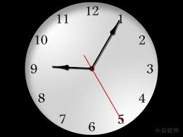
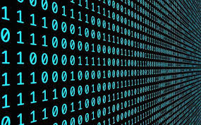

## 计算机底层揭秘之
### byte为什么是[-128,127]


`zhoujun5@jd.com`

---

## 重要假设

>假设一个数用四位二进制位来表示

> 本文只涉及加减运算

---

## 前言


世界阴阳并存

人分善恶，数有正负

---


- 计算机用二进制的规则表示自然数

- 那么如果是负数怎么表示呢？

---

## 符号位

最高位表示符号位,**0为正数**,**1为负数**

我觉得本质上<span class="fragment highlight-red">**符号位**
</span>就是为了解决计算机<span class="fragment highlight-red">如何表示**负数**</span>而出现的。


>ps: 可以思考一下，为什么0是正数，1是负数？

---

## 运算

- 根据冯诺依曼计算机体系得知，一台计算机由运算器，控制器，存储器，输入输出设备组成。


>其中运算器只有加法运算器(加、减、乘、除)

---

## 计算之旅-原码

```
4+2=0100+0010=0110=6

4-2=4+(-2)=0100+1010=1110=-6

4-2=2+2-2

2-2=2+(-2)=0010+1010=-4

```

- 如果2-2等于0的话，那么结果是不是正确的？

- 怎么解决相反数相加不等于0的问题呢？

---

## 计算之旅-反码


- 某一个负数是某一个正数的相反数，我们把这个正数全部按位取反来表示负数，这样相反数相加的结果就等于0了

- 这种表示方式叫反码


---

- 2是0010，那么-2就是1101

```
4-2=0100(反码)+1101(反码)=0001(反码)=0001=1

2-2=0010+1101=1111(反码)=1000=-0

-4-2=1011+1101=1000(反码)=1111=-7

-1-2=1110+1101=1011(反码)=1100=-4
```

---


- 然后发现除了两个相反数相加稍微接近我们所熟知的结果，其他的结果简直不忍直视，所以用反码来表示负数也是不靠谱的。

---

- 有负数参与的情况下，加结果加上一即可修正结果 

```
4-2=0100(反)+1101(反码)=0001+1=0010=2 结果正确

-4-2=1011+1101=1000(反码)+1=1001(反码)=1110=-6 结果正确

-1-2=1110+1101=1011(反码)+1=1100(反码)=1011=-3 结果正确

2-2=0010+1101=1111(反码)+1=0000=0

2+2=0010+0010=0100=4 结果正确
```

---

## 计算之旅-补码

那怎么办呢,怎么来解决负数的表示问题呢？


---


+ 伟大的科学家们观察自然界的运行规律，总结出了两个很牛逼的概念，一个叫 **"模"**，一个叫 **"补数"**

---

## 计算之旅-补码-模


+ 啥是模？肉夹馍？羊肉泡馍？

---

>官方术语：“模”是指一个计量系统的计数范围。如时钟、计算机等。

+ 只要有一个计量范围，即都存在一个“模”。“模”实质上是计量器产生“溢出”的量,它的值在计量器上表示不出来,计量器上只能表示出模的余数。

---

<div class="container">
  <div class="row">
    <div class="col">
      
    </div>
    <div class="col">
      十二小时制的时钟采用的是十二进制，到了12点，就又从1开始了，所以12是时钟系统的模。计算机真正十二进制中只有0到11，<span class="fragment highlight-red">12表示不出来</span>
    </div>
  </div>
</div>

note:
就是哈比如说，十二小时制的时钟这个是不是采用的是十二进制，并且呢一到了12点，再向后就又从1开始了，所以12是时钟系统的模。如果严格按照定义来讲的话，十二进制在计算机里面表示的是0到11十二个数，12属于溢出的数

---

啥是补数呢？

---

>民间解释：当M是系统的模的时候，如果|A|+|B|=M，我们就说A的补数是B

+ 这个概念跟补角的概念类似，如果两个角相加为180°，那么称两个角互补。

---

+ 以时钟为例，现在是两点，你要把它变成一点你会怎么做？

---

+ 逆时针旋转时针一格

+ 顺时针旋转十一格

---

>假设顺时针是正，逆时针是负

> 得出：2-1=2+11

<span style="color:red">因为 1 和 11是补数</span>

---

<div class="container">
  <div class="row">
    <div class="col">
      
    </div>
    <div class="col">
      <span style="font-size:20px">
      将时钟迁移到计算机系统：比如一个4位的二进制，最多可以表示2^4=16个数，最大的数是<span style="color:red">1111=15</span>，超过1111就会发生进位的情况，变成<span style="color:red">10000</span>，因为只有四位，所以表示的是<span style="color:red">0000=0</span>，然后再加一，变成<span style="color:red">0001=1</span>，开始了循环，那么<span style="color:red">模的值就是16这个溢出的值。</span>
      </span> 
    </div>
  </div>
</div>


>ps:所有数都是正数的情况和有正有负的情况是一样的，16都是模

---

所以如何把减法变成加法？


---

加上他的补数就可以了

---


```
4-2=4+14=0100+1110=0010=2

-4-2=12+14=1100+1110=1010=10=-6(最高位是1所以是最后是负数)

-1-2=15+14=1111+1110=1101=13=-3(最高位是1所以是最后是负数)

2-2=2+14=0010+1110=0000=0
```

+ 用14来表示-2的方式称为补码的方式，-2的补码就是**1110**，只不过它刚好等于反码加一而已。

+ 最高位表明了正负，并且可以直接参与运算。

---

+ 这样计算机的设计只需要支持加法计算器，支持补码的编码方式就行，电路会负担比较小。

---

+ 到此，负数的编码告一段落，还有一个问题就是为什么在符号位1表示负数，0表示正数？

---

## byte的取值范围

回到正题，为啥byte的范围是-128到正的127？

---

+ 在java中byte是用一个字节来表示也就是8位的二进制


+ java不支持无符号类型，全是有符号类型的数

>得出结论：最高位是符号位

---

正数的最大值是<span style="color:red">**01111111**</span>=127

---

负数的范围是<span style="color:red">**11111111**</span>
到<span style="color:red">**10000000**</span>

八位二进制的模是<span style="color:red">256</span>

11111111=255=-1

10000000=128=-128

所以负数最大到了<span style="color:red">-128</span>

---

<span style="color:red">byte的取值范围为[-128,127]</span>


---


你以为这就完了吗？

---

### 为什么0表示正数1表示负数


+ <span style="font-size:25px">
    猜测一：最高位是符号位这点是必须的(因为需要表示负数)，所以是剩下的位数来表示数的值，拿4位来说，三位的正数最大是111=7，0到7，然后4位表示的数只能有16个数，所以还剩下8个数，所以负数最小不会小于-8，范围可能是-1到-8，那-1到-8的话，补数就是8到15全是比8大的数，所以最高位肯定是1，所以负数的补码最高位肯定是1，也许这就是负数的符号位是1的原因
</span> 

---

## END

感谢大家的时间！

