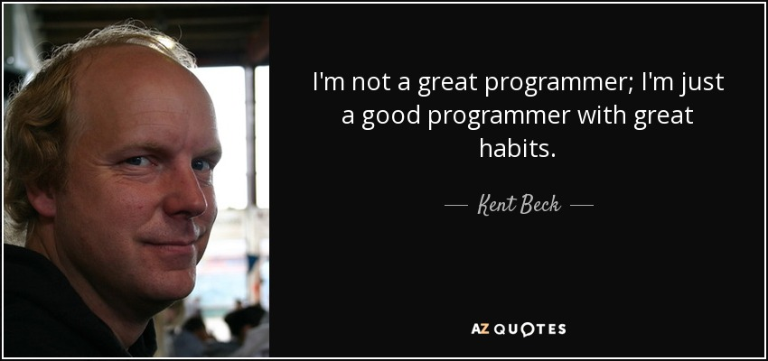

## 计算机底层揭秘之
### byte为什么是[-128,127]


`zhoujun5@jd.com`

--

## 重要假设

>假设一个数用四位来表示

> 本文只涉及加减运算

--

## 前言


世界阴阳并存

人分善恶，数有正负

--

<!-- .slide: data-background="#4d7e65"-->
## 前言

- 计算机用二进制的规则表示自然数

- 那么如果是负数怎么表示呢？

--

## 符号位

最高位表示符号位,**0为正数**,**1为负数**

我觉得本质上<span class="fragment highlight-red">**符号位**
</span>就是为了解决计算机<span class="fragment highlight-red">如何表示**负数**</span>而出现的。


>ps: 可以思考一下，为什么0是正数，1是负数？

--

## 运算

- 根据冯诺依曼计算机体系得知，一台计算机由运算器，控制器，存储器，输入输出设备组成。


>其中运算器只有加法运算器(加、减、乘、除)

--

## 计算之旅-原码

```
4+2=0100+0010=0110=6

4-2=4+(-2)=0100+1010=1110=-6

4-2=2+2-2

2-2=2+(-2)=0010+1010=-4

```

- 如果2-2等于0的话，那么结果是不是正确的？

- 怎么解决相反数相加不等于0的问题呢？

--

## 计算之旅-反码


- 某一个负数是某一个正数的相反数，我们把这个正数全部按位取反来表示负数，这样相反数相加的结果就等于0了

- 这种表示方式叫反码


--

## 计算之旅-反码

- 2是0010，那么-2就是1101

```
4-2=0100+1101=0001(反码)=0001=1

2-2=0010+1101=1111(反码)=1000=-0

-4-2=1011+1101=1000(反码)=1111=-7

-1-2=1110+1101=1011(反码)=1100=-4
```

--

## 计算之旅-反码

- 然后发现除了两个相反数相加稍等接近我们所熟知的结果，其他的结果简直不忍直视，所以用反码来表示负数也是不靠谱的。

--


## 计算之旅-反码-修正

- 如果符号位有进位的情况下，将进位加到结果的最后一位

- 存在负数的加法必定存在符号位进位 

```
4-2=0100+1101=0001+1=0010=2 结果正确

-4-2=1011+1101=1000(反码)+1=1001(反码)=1110=-6 结果正确

-1-2=1110+1101=1011(反码)+1=1100(反码)=1011=-3 结果正确

2-2=0010+1101=1111(反码)+1=0000=0
```

--

## 计算之旅-补码

那怎么办呢,怎么来解决负数的表示问题呢？


--

## 计算之旅-补码


+ 伟大的科学家们观察自然界的运行规律，总结出了两个很牛逼的概念，一个叫"模"，一个叫"补数"

--

## “会作秀”的煮饭仙人

<div class="container">
  <div class="row">
    <div class="col">
      
    </div>
    <div class="col">
      
    </div>
  </div>
  <div class="row">
    <div class="col">
      
    </div>
    <div class="col">
      
    </div>

  </div>
</div>

note:
每次煮饭定量三升米，淘米要用流水不停冲洗，让每颗米粒充分摩擦又不可用蛮力以免米粒受到伤害。米要浸泡40分钟，水一定要在前一晚放入装有长炭的大瓦罐中静置

---

## “假谦虚”的学霸



---

<!-- .slide: data-transition="slide" data-background="#b5533c" data-background-transition="zoom" -->
## 银河补习班

马浩文坐牢是不是怪他的徒弟大头？


---

<!-- .slide: data-transition="slide" data-background="#b5533c" data-background-transition="zoom" -->
## 开县井喷


<small>重庆市第二中级人民法院以重大责任事故罪判分别处被告人吴斌有期徒刑六年；判处被告人王建东有期徒刑五年；判处被告人宋涛有期徒刑五年；判处被告人吴华有期徒刑四年；判处被告人向一明有期徒刑三年；判处被告人肖先素有期徒刑三年，宣告缓刑四年</small>

---

<!-- .slide: data-transition="slide" data-background="#b5533c" data-background-transition="zoom" -->
## 线上事故

- 使用 `==` 而不是 `equals`
- 在循环中进行远程调用
- 修改代码后未经过单元测试就上线
- 本地测试时写死的值提交到代码库并最终上线
- 修改代码后未提测就上线
- 未按规定时间上线
- 一次性上线所有应用实例
- 线上环境未配置数据库连接
- 架构设计隐患未发现多年后暴雷

---

## 所以


我们要 <span class="fragment highlight-red">**找到正确的方法**</span> <span class="fragment  highlight-blue">**坚持执行**</span>

<span class="fragment">**然后我们拥有了伟大的习惯**</span>

---

<!-- .slide: data-transition="slide" data-background="#4d7e65" data-background-transition="zoom" -->
## 正确的方法

- 组织
- 流程
- 工具


--

<!-- .slide: data-background="#4d7e65"-->
## 组织

- 资深工程师团队
- 学习小组
- ……

--

<!-- .slide: data-background="#4d7e65"-->

## 流程

- 新员工培训流程
- 开发流程
- 上线流程
- 线上问题处理流程
- ……

--

<!-- .slide: data-background="#4d7e65"-->

## 工具

- 代码检查工具
- 知识中心 - 规范/案例/模板
- 根因分析
- ……

--

<!-- .slide: data-background="#4d7e65"-->
## 案例1

根因分析


--

<!-- .slide: data-background="#4d7e65"-->
## 案例1

改进措施

- 制定多线程编码规范，包括使用场景、模式、模板、编写单元测试的方式等，在知识中心维护 @资深工程师团队 12/28
- 在新员工培训流程中加入多线程编码规范的宣导  @张三 12/30
- 上线前代码如果有多线程相关代码必须找@资深工程师团队成员review，review的check点包括第一条的使用场景是否合理、是否用了要求的模板或模式以及必须要有充分的单元测试 @李四 负责把细化此规则，写到文档中心

---


## 坚持很难


---

## 熬过漫长的绝望之坡

- 信念 - ABC
- 逻辑 - 无法结果证明的时候，最起码逻辑上没有漏洞
- 经验 - 间接经验也是经验

---

## 坚持并不难

100%地去坚守你的原则，总比98%坚持要**容易**，因为一旦有破例，就很容易为其它情况找理由。假如你越过这道防线一次，在今后可能将会一次又一次地越过这道防线。你必须给你自己的原则做个定义，然后以你的原则为基准，给自己划一个安全的防线。

 -- 克里斯坦森，《创新者的窘境》作者

note:
老师说，稳定在90分很容易，只要坚持好的学习方法和习惯，但控制在85分很难。

---

## 何为能力

- 解决别人解决不了的问题
- 更快更好地解决别人能解决的问题
- 创造预期之外的价值

---


# THE END

- [Vscode Reveal](https://marketplace.visualstudio.com/items?itemName=evilz.vscode-reveal)
- [reveal.js](https://github.com/hakimel/reveal.js/)
- [slideasy](https://github.com/codeasycc/slideasy)

