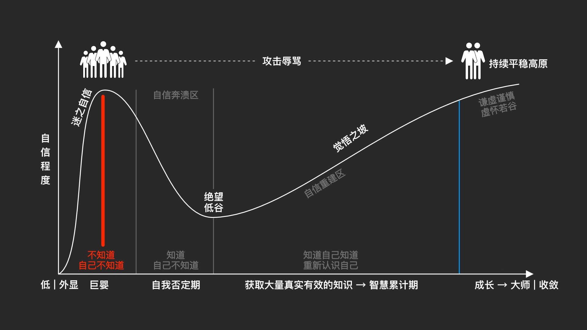

# 靠谱

成为值得信赖（trustworthy）的团队

`yanhua@jd.com`

---

## 什么是靠谱度（K）

> K=i×a/c^2

- i : 稳定程度 <!-- .element: class="fragment highlight-red"-->
- a : 能力的强弱<!-- .element: class="fragment highlight-red"-->
- c : 外界环境因素干扰大小<!-- .element: class="fragment highlight-green"-->

---

## 何为稳定程度

<canvas class="stretch" data-chart="line">

优秀标准,  85, 85, 85, 85, 85, 85, 85

<!-- This is a comment -->

我的成绩, 77, 90, 82, 72, 88, 75, 98

<!-- 

{ 

"data" : {

    "labels" : ["第一次", "第二次", "第三次", "第四次", "第五次", "第六次", "第七次"],

    "datasets" : [{ "borderColor": "#0f0", "borderDash": ["5","10"] }, { "borderColor": "#0ff" } ]

    }

}

-->

</canvas>

> 特性随时间恒定的能力

---

## 影响了苹果的家具

---

## “会作秀”的煮饭仙人

  

    

      
    

    

      
    

  

  

    

      
    

    

      
    

  

note:
每次煮饭定量三升米，淘米要用流水不停冲洗，让每颗米粒充分摩擦又不可用蛮力以免米粒受到伤害。米要浸泡40分钟，水一定要在前一晚放入装有长炭的大瓦罐中静置

---

## “假谦虚”的学霸

---

<!-- .slide: data-transition="slide" data-background="#b5533c" data-background-transition="zoom" -->
## 银河补习班

马浩文坐牢是不是怪他的徒弟大头？

---

<!-- .slide: data-transition="slide" data-background="#b5533c" data-background-transition="zoom" -->
## 开县井喷

<small>重庆市第二中级人民法院以重大责任事故罪判分别处被告人吴斌有期徒刑六年；判处被告人王建东有期徒刑五年；判处被告人宋涛有期徒刑五年；判处被告人吴华有期徒刑四年；判处被告人向一明有期徒刑三年；判处被告人肖先素有期徒刑三年，宣告缓刑四年</small>

---

<!-- .slide: data-transition="slide" data-background="#b5533c" data-background-transition="zoom" -->
## 线上事故

- 使用 `==` 而不是 `equals`
- 在循环中进行远程调用
- 修改代码后未经过单元测试就上线
- 本地测试时写死的值提交到代码库并最终上线
- 修改代码后未提测就上线
- 未按规定时间上线
- 一次性上线所有应用实例
- 线上环境未配置数据库连接
- 架构设计隐患未发现多年后暴雷

---

## 所以

我们要 **找到正确的方法** **坚持执行**

**然后我们拥有了伟大的习惯**

---

<!-- .slide: data-transition="slide" data-background="#4d7e65" data-background-transition="zoom" -->
## 正确的方法

- 组织
- 流程
- 工具

--

<!-- .slide: data-background="#4d7e65"-->
## 组织

- 资深工程师团队
- 学习小组
- ……

--

<!-- .slide: data-background="#4d7e65"-->

## 流程

- 新员工培训流程
- 开发流程
- 上线流程
- 线上问题处理流程
- ……

--

<!-- .slide: data-background="#4d7e65"-->

## 工具

- 代码检查工具
- 知识中心 - 规范/案例/模板
- 根因分析
- ……

--

<!-- .slide: data-background="#4d7e65"-->
## 案例1

根因分析

--

<!-- .slide: data-background="#4d7e65"-->
## 案例1

改进措施

- 制定多线程编码规范，包括使用场景、模式、模板、编写单元测试的方式等，在知识中心维护 @资深工程师团队 12/28
- 在新员工培训流程中加入多线程编码规范的宣导  @张三 12/30
- 上线前代码如果有多线程相关代码必须找@资深工程师团队成员review，review的check点包括第一条的使用场景是否合理、是否用了要求的模板或模式以及必须要有充分的单元测试 @李四 负责把细化此规则，写到文档中心

---

## 坚持很难

---

## 熬过漫长的绝望之坡

- 信念 - ABC
- 逻辑 - 无法结果证明的时候，最起码逻辑上没有漏洞
- 经验 - 间接经验也是经验

---

## 坚持并不难

100%地去坚守你的原则，总比98%坚持要**容易**，因为一旦有破例，就很容易为其它情况找理由。假如你越过这道防线一次，在今后可能将会一次又一次地越过这道防线。你必须给你自己的原则做个定义，然后以你的原则为基准，给自己划一个安全的防线。

 -- 克里斯坦森，《创新者的窘境》作者

note:
老师说，稳定在90分很容易，只要坚持好的学习方法和习惯，但控制在85分很难。

---

## 何为能力

- 解决别人解决不了的问题
- 更快更好地解决别人能解决的问题
- 创造预期之外的价值

---

# THE END

- [Vscode Reveal](https://marketplace.visualstudio.com/items?itemName=evilz.vscode-reveal)
- [reveal.js](https://github.com/hakimel/reveal.js/)
- [slideasy](https://github.com/codeasycc/slideasy)

